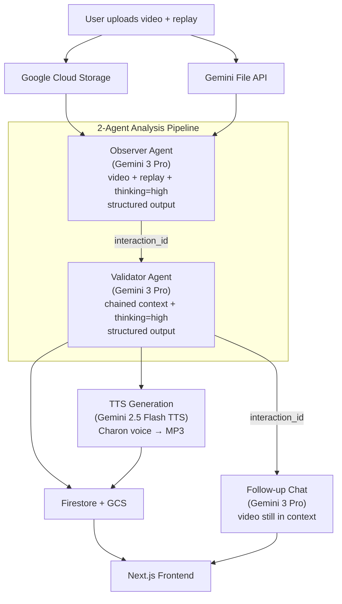

# Forging

**AI-powered esports coaching — upload a gameplay video, get timestamped coaching tips from Gemini 3.**

**[Live Demo](https://forging-frontend-nht57oxpca-uc.a.run.app)**

## The Problem

Competitive gaming has 640M+ viewers and a $2.4B esports industry, but improving as a player remains expensive and inaccessible. Human coaching costs $15–100+/hour. Players watch their own replays but can't reliably spot their own mistakes. Existing AI tools (Trophi.ai, Omnic.ai, iTero) are locked to a single game and require proprietary data pipelines.

## The Solution

1. **Upload** a gameplay video (MP4) and optional replay file
2. **Gemini 3 Pro watches the video** and generates timestamped coaching tips via a 2-agent pipeline (Observer → Validator)
3. **Tips are verified** against video evidence — hallucinated tips are removed via confidence scoring
4. **Get results**: spoken audio coaching, shareable links, and follow-up chat with the video still in context

Key differentiators:

- **Game-agnostic**: Works from video alone. Supports AoE2 and CS2 today, extensible to any game.
- **Multi-agent verification**: Observer generates tips; Validator cross-checks each one against the video. Only verified tips are returned.
- **No game API needed**: Unlike competitors, works from raw video — no proprietary data pipeline required.

## Built with Gemini 3

| # | Feature | How Forging Uses It |
|---|---------|---------------------|
| 1 | **File API** | Upload gameplay videos (MP4, up to 700MB). Video uploaded once, reused across entire agent chain. |
| 2 | **Multimodal Video Analysis** | Gemini 3 Pro watches gameplay video alongside replay data. Identifies mistakes and timestamps them. |
| 3 | **Thinking (Extended Reasoning)** | `thinking_level="high"` for Observer and Validator agents. Enables deeper analysis and careful hallucination detection. |
| 4 | **Interactions API** | `previous_interaction_id` chains Observer → Validator → Chat. Video and context persist on Gemini's servers — no re-upload. |
| 5 | **Text-to-Speech** | Gemini 2.5 Flash TTS with "Charon" voice generates spoken coaching tips as MP3 audio. |
| 6 | **Structured Output** | JSON schema enforcement ensures deterministic tip format: timestamp, category, severity, observation, fix, reasoning. |

### Models Used

| Model | Purpose |
|-------|---------|
| `gemini-3-pro-preview` | Analysis, validation, follow-up chat |
| `gemini-3-flash-preview` | Round detection (fast) |
| `gemini-2.5-flash-preview-tts` | Voice coaching audio |

## Architecture



The **Interactions API** is central to the architecture: the gameplay video is uploaded once to Gemini's File API and stays in context across the entire Observer → Validator → Chat chain via `previous_interaction_id`. This eliminates redundant video re-uploads and keeps the full conversation history available for follow-up questions.

## Features

**Video Analysis:**
- Upload gameplay videos (MP4, up to 700MB, 30 min)
- Timestamped coaching tips with clickable video timestamps
- AI-generated spoken coaching (TTS audio per tip)
- Follow-up chat with AI coach (video stays in context)
- Multi-agent verification eliminates hallucinated tips

**Platform:**
- Shareable analysis links
- Community carousel
- CS2 round navigation with death-time awareness
- Replay file parsing for ground-truth data

## Supported Games

- **Age of Empires II: Definitive Edition** — `.aoe2record` replays + video
- **Counter-Strike 2** — `.dem` demos + video

Architecture is game-agnostic. Adding a game = implementing an Observer + Validator agent pair. No game API needed.

## Tech Stack

- **Frontend**: Next.js 16, React 19, TypeScript, Tailwind CSS 4
- **Backend**: Python 3.12, FastAPI, uvicorn
- **AI**: Gemini 3 Pro, Gemini 3 Flash, Gemini 2.5 Flash TTS
- **Parsing**:
  - AoE2: [mgz](https://github.com/happyleavesaoc/aoc-mgz)
  - CS2: [demoparser2](https://github.com/LaihoE/demoparser), [awpy](https://github.com/pnxenopoulos/awpy)
- **Cloud**: Google Cloud Run, Cloud Storage, Firestore

## Local Development

### Prerequisites

- Node.js 20+
- Python 3.11+
- pnpm
- Gemini API key (get one at [Google AI Studio](https://aistudio.google.com/))

### Setup

1. **Clone the repository**
   ```bash
   git clone git@github.com:lucaslencinas/forging.git
   cd forging
   ```

2. **Set up the backend**
   ```bash
   cd backend
   python -m venv venv
   source venv/bin/activate  # On Windows: venv\Scripts\activate
   pip install -r requirements.txt
   cp .env.example .env
   # Edit .env and add your GEMINI_API_KEY
   ```

3. **Run the backend**
   ```bash
   uvicorn main:app --reload --port 8080
   ```

4. **Set up the frontend** (in a new terminal)
   ```bash
   cd frontend
   pnpm install
   cp .env.example .env.local
   ```

5. **Run the frontend**
   ```bash
   pnpm dev
   ```

6. **Open http://localhost:3000**

**Backend API**: https://forging-backend-nht57oxpca-uc.a.run.app

### Environment Variables

#### Backend (`backend/.env`)
```bash
# Gemini API (required)
GEMINI_API_KEY=your_gemini_api_key

# Optional: Multiple API keys for rate limit fallback (comma-separated)
# GEMINI_API_KEYS=key1,key2,key3

# Server config
ALLOWED_ORIGINS=http://localhost:3000
LOG_LEVEL=INFO

# GCS config (only needed for video uploads - uses demo mode without it)
# GOOGLE_CLOUD_PROJECT=your-project-id
# GCS_BUCKET_NAME=your-bucket-name
# GCP_LOCAL_ACCOUNT=your-email@gmail.com
```

#### Frontend (`frontend/.env.local`)
```
NEXT_PUBLIC_API_URL=http://localhost:8080
```

### Note for Contributors

The video upload feature requires GCP credentials (Cloud Storage). Without GCP setup:
- **Replay analysis works fully** — Just needs a Gemini API key
- **Video upload is disabled** — Requires GCS bucket access

For hackathon judges: Use the [live demo](https://forging-frontend-nht57oxpca-uc.a.run.app) to test video features, or run locally for replay-only analysis.

## Project Structure

```
forging/
├── frontend/               # Next.js application
│   ├── src/
│   │   ├── app/            # App router pages
│   │   ├── components/     # React components
│   │   │   ├── VideoPlayer.tsx        # Video player with seek
│   │   │   ├── TimestampedTips.tsx    # Clickable coaching tips
│   │   │   └── VideoAnalysisResults.tsx
│   │   ├── hooks/          # Custom hooks
│   │   │   └── useVideoUpload.ts      # GCS upload with progress
│   │   └── types/          # Generated API types
│   └── package.json
├── backend/                # Python FastAPI application
│   ├── main.py             # API entry point
│   ├── models.py           # Pydantic models
│   ├── analyze.py          # CLI tool
│   ├── services/
│   │   ├── pipelines/      # Game-specific analysis pipelines
│   │   │   ├── base.py     # Base pipeline class
│   │   │   ├── factory.py  # Pipeline factory
│   │   │   ├── aoe2/       # AoE2: observer, validator
│   │   │   └── cs2/        # CS2: observer, validator, round_detector
│   │   ├── agents/         # Base agent class (Interactions API)
│   │   │   └── base.py
│   │   ├── tts.py          # Gemini TTS audio generation
│   │   ├── gcs.py          # Cloud Storage
│   │   ├── firestore.py    # Firestore persistence
│   │   ├── thumbnail.py    # Thumbnail generation
│   │   ├── llm/            # LLM provider abstraction
│   │   │   ├── base.py     # Abstract provider class
│   │   │   ├── gemini.py   # Gemini + File API
│   │   │   └── factory.py  # Provider auto-selection
│   │   ├── knowledge/      # Game-specific coaching knowledge
│   │   │   ├── aoe2.py
│   │   │   └── cs2.py
│   │   └── parsers/        # Replay file parsers
│   │       ├── aoe2.py
│   │       └── cs2.py
│   └── requirements.txt
├── .github/workflows/      # CI/CD pipelines
│   ├── deploy-backend.yml
│   └── deploy-frontend.yml
└── deploy/                 # GCS CORS config
```

## Research & References

### Multi-Agent System Design

This project's architecture is informed by recent research on scaling agent systems:

- **[Towards a science of scaling agent systems: When and why agent systems work](https://research.google/blog/towards-a-science-of-scaling-agent-systems-when-and-why-agent-systems-work/)** (Google Research, 2025)

  Key insight: Multi-agent AI systems don't universally improve performance. Their effectiveness depends on task characteristics and coordination architecture. For parallelizable tasks (like analyzing different aspects of gameplay), centralized coordination can improve performance by up to 80%. However, independent agents can amplify errors up to 17x without proper orchestration.

## License

MIT

---

Built for the [Gemini API Developer Competition](https://gemini3.devpost.com/)
